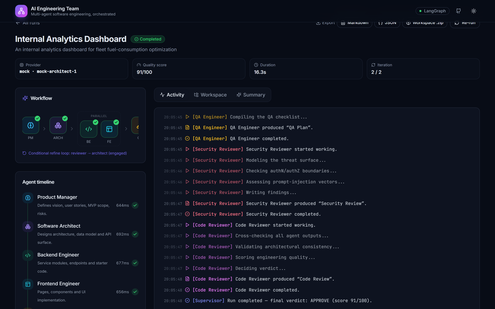
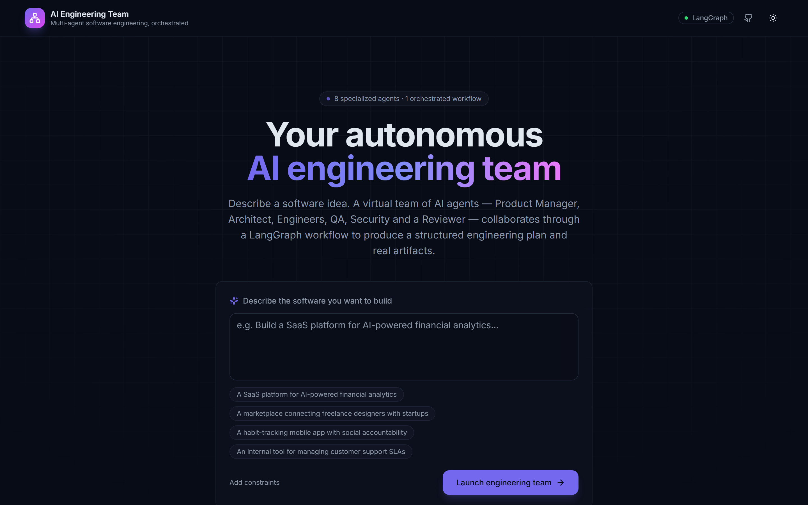
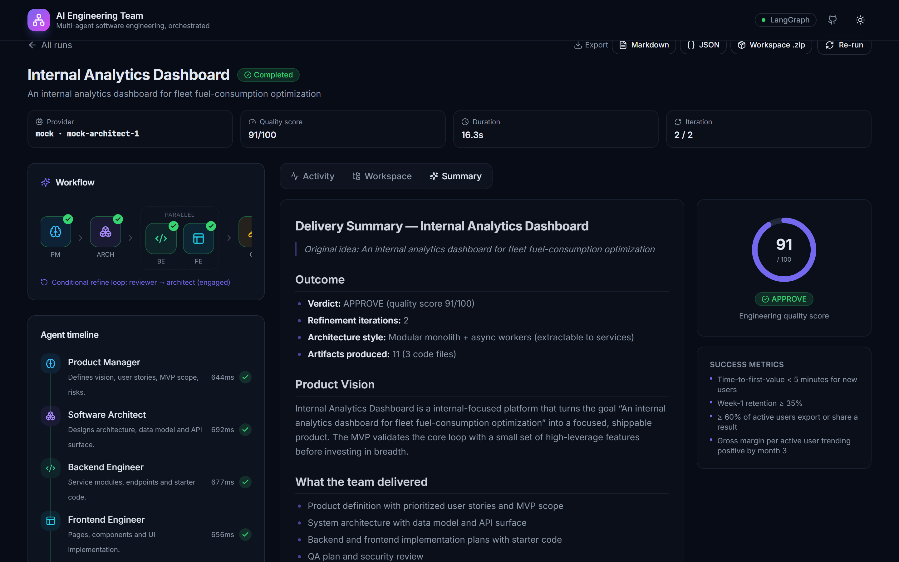
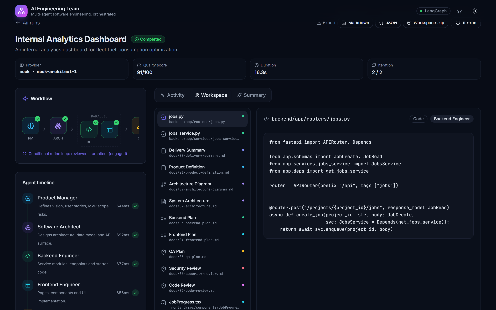

<div align="center">

# 🧠 AI Engineering Team

### An autonomous, multi-agent software-engineering platform built on LangGraph

Describe a software idea in plain English. A virtual team of specialized AI agents —
Product Manager, Architect, Backend & Frontend Engineers, QA, Security and a Code
Reviewer — collaborates through a **stateful LangGraph workflow** to turn it into a
structured engineering plan and real, exportable artifacts.

[Features](#-features) · [Architecture](#-architecture) · [Workflow](#-the-langgraph-workflow) · [Quickstart](#-quickstart) · [API](#-api) · [Roadmap](#-roadmap)


</div>

> **Runs with zero API keys.** A deterministic mock provider drives the entire
> platform end-to-end, so anyone can clone and run the full experience in minutes.
> Drop in an Anthropic or OpenAI key to switch to real models — no code changes.

---

## 📸 Screenshots

<p align="center">
  
  <br/>
  <em>The live dashboard — workflow graph, agent timeline and a real-time activity feed streaming each agent's actions over SSE.</em>
</p>

<table>
  <tr>
    <td width="50%"></td>
    <td width="50%"></td>
  </tr>
  <tr>
    <td align="center"><em>Landing — describe a software idea</em></td>
    <td align="center"><em>Delivery summary — verdict, score and outcome</em></td>
  </tr>
  <tr>
    <td colspan="2"></td>
  </tr>
  <tr>
    <td colspan="2" align="center"><em>Artifact workspace — browse every doc and code file the agents produced</em></td>
  </tr>
</table>

---

## ✨ Features

- **True multi-agent orchestration** — 7 specialized agents + a supervisor,
  wired as a LangGraph `StateGraph` with **parallel fan-out**, a **join**, and a
  **bounded conditional refine loop**.
- **Live, cinematic activity feed** — every agent action streams to the UI over
  **Server-Sent Events**, with late-join replay (no gaps if you reload).
- **Structured outputs everywhere** — each agent returns a typed Pydantic model
  (enforced via constrained decoding on real providers; deterministic on mock).
- **Real artifact workspace** — product specs, architecture (with a Mermaid
  diagram), backend/frontend plans + starter code, QA & security reports, and an
  executive delivery summary. Browse a file tree; export to **Markdown / JSON /
  `.zip`**.
- **Observable & persistent** — runs, an event log, and artifacts are persisted;
  the agent timeline is *derived* from events, so it never drifts.
- **Provider abstraction** — `mock` / `anthropic` / `openai` behind one
  interface, with graceful fallback to mock when keys are missing.
- **Production-minded** — typed settings, structured logging, async SQLAlchemy
  (SQLite or Postgres), Docker Compose, 27 backend tests, dark-mode UI.

---

## 🏗 Architecture

```
┌──────────────────────────┐        SSE (live activity)         ┌───────────────────────────┐
│        Frontend          │ ◀───────────────────────────────── │          Backend          │
│  Next.js · TS · Tailwind │ ──── REST (create / read / export) ▶│   FastAPI · LangGraph     │
│  Create · Dashboard ·    │                                    │   Orchestrator · 7 Agents │
│  Activity feed · Graph · │                                    │   LLM provider abstraction│
│  Artifact explorer       │                                    │            │              │
└──────────────────────────┘                                    └────────────┼──────────────┘
                                                                 PostgreSQL / SQLite (runs · events · artifacts)
```

Backend layering (dependencies point inward):

```
api → services → graph → agents → llm
            └──→ repositories → models → db
```

Full write-up: **[docs/ARCHITECTURE.md](docs/ARCHITECTURE.md)**.

### Tech stack

| Layer | Choices |
| --- | --- |
| Orchestration | **LangGraph** (state, parallelism, conditional routing, checkpointer) |
| Backend | **FastAPI**, Pydantic v2, async SQLAlchemy 2.0, structlog, SSE |
| AI | LangChain structured outputs; Anthropic / OpenAI / deterministic mock |
| Frontend | **Next.js 14** (App Router), TypeScript, TailwindCSS, shadcn-style UI, lucide |
| Data | PostgreSQL (Docker) / SQLite (local) |
| Infra | Docker + Docker Compose; pytest; ruff/mypy |

---

## 🔄 The LangGraph workflow

```
START → product_manager → architect ─┬─→ backend_engineer ─┐
                                      └─→ frontend_engineer ─┴─→ qa_engineer
   → security_reviewer → code_reviewer ─(conditional)─┬─ refine → architect
                                                      └─ finalize → END
```

- `architect` **fans out** to both engineers (parallel); `qa_engineer` **joins**
  (waits for both).
- `code_reviewer` is the only **branch**: `approve` → finalize, or `revise` →
  loop back through `refine` (bounded by `max_iterations`).
- Provider + event emitter are injected via LangGraph `config`; a `MemorySaver`
  checkpointer makes runs replayable.

Deep dive: **[docs/WORKFLOW.md](docs/WORKFLOW.md)**.

---

## 🚀 Quickstart

### Option A — Docker (full stack)

```bash
cp .env.example .env            # defaults to key-free mock mode
docker compose up --build
# Frontend → http://localhost:3000   ·   API docs → http://localhost:8000/docs
```

### Option B — Local dev

**Backend** (Python 3.11+):

```bash
cd backend
python -m venv .venv
# Windows:           .venv\Scripts\activate
# macOS/Linux:       source .venv/bin/activate
pip install -r requirements-dev.txt
cp .env.example .env
uvicorn app.main:app --reload --port 8000
```

**Frontend** (Node 18+):

```bash
cd frontend
npm install
npm run dev        # http://localhost:3000  (proxies /api → :8000)
```

**Windows one-liners** (PowerShell):

```powershell
scripts\setup.ps1            # venv + npm install
scripts\start-backend.ps1    # terminal 1
scripts\start-frontend.ps1   # terminal 2
```

### Try it without the UI

```bash
cd backend
python scripts/run_workflow.py "Build a SaaS platform for AI-powered financial analytics"
```

You'll watch the full team collaborate in your terminal, including the refine loop.

---

## ⚙️ Configuration

All settings have safe defaults (`backend/.env.example`):

| Variable | Default | Description |
| --- | --- | --- |
| `LLM_PROVIDER` | `mock` | `mock` · `anthropic` · `openai` |
| `ANTHROPIC_API_KEY` / `OPENAI_API_KEY` | — | Required only for real providers |
| `ANTHROPIC_MODEL` / `OPENAI_MODEL` | `claude-sonnet-4-6` / `gpt-4o` | Model ids |
| `DATABASE_URL` | `sqlite+aiosqlite:///./aiteam.db` | Swap for Postgres |
| `MAX_ITERATIONS` | `2` | Review/refine cycles before forced finalize |
| `AGENT_MAX_RETRIES` | `2` | Per-agent retry budget on transient errors |
| `MOCK_LATENCY_SECONDS` | `0.6` | Mock pacing for the live feed (`0` = instant) |

Switch to real models:

```bash
LLM_PROVIDER=anthropic
ANTHROPIC_API_KEY=sk-ant-...
```

---

## 🔌 API

| Method | Path | Description |
| --- | --- | --- |
| `POST` | `/api/projects` | Create a project and launch a run |
| `GET` | `/api/projects` | List projects |
| `POST` | `/api/projects/{id}/rerun` | Re-run a project (edit-and-rerun) |
| `GET` | `/api/runs/{id}` | Full run detail (status, steps, outputs) |
| `GET` | `/api/runs/{id}/events` | Persisted event log (replay) |
| `GET` | `/api/runs/{id}/stream` | **SSE** live activity stream |
| `GET` | `/api/runs/{id}/artifacts` · `/tree` | Artifacts + workspace tree |
| `GET` | `/api/runs/{id}/export.{md,json,zip}` | Export the deliverables |

Interactive docs at `http://localhost:8000/docs`.

---

## 🧪 Tests

```bash
cd backend && pytest         # 27 tests: providers, agents, routing, full graph, API
```

Coverage spans the deterministic mock provider, every agent's output + artifacts,
the conditional routing logic, an end-to-end graph run (including the refinement
iteration), and an API-level create→complete→export flow.

---

## 📁 Repository structure

```
ai-engineering-team/
├─ backend/
│  ├─ app/
│  │  ├─ agents/        # 7 specialized agents + registry
│  │  ├─ graph/         # LangGraph: state, nodes, routing, builder
│  │  ├─ llm/           # provider abstraction (mock/anthropic/openai) + mock data
│  │  ├─ api/routes/    # health, projects, runs (SSE), artifacts
│  │  ├─ services/      # orchestration, projects, artifacts, serializers
│  │  ├─ repositories/  # data access
│  │  ├─ models/ db/    # ORM + async session
│  │  ├─ schemas/       # structured outputs, events, DTOs
│  │  └─ core/          # event hub / emitter
│  ├─ tests/            # pytest suite
│  └─ scripts/          # CLI workflow runner
├─ frontend/
│  └─ src/
│     ├─ app/           # App Router pages
│     ├─ components/    # UI primitives + feature components
│     ├─ hooks/         # useRunStream (SSE)
│     └─ lib/           # typed API client, types, agent metadata
├─ docs/                # ARCHITECTURE.md · WORKFLOW.md
├─ docker-compose.yml
└─ Makefile
```

---

## 🧭 Engineering decisions

- **Mock-first design.** A flagship portfolio project must run instantly. The
  mock provider is deterministic, so demos are reproducible and tests are stable.
- **Events as the source of truth.** The agent timeline is derived from the event
  log, eliminating a class of state-drift bugs.
- **Structured outputs over prompt-parsing.** Typed contracts make the system
  testable and the same code works across providers.
- **Modular monolith.** Clean package seams (`graph/`, `agents/`, `llm/`) keep it
  simple now and extractable later.

---

## 🗺 Roadmap

- [ ] Per-step retry & resume from a checkpoint (UI controls)
- [ ] Human-in-the-loop approval gates between phases
- [ ] Vector memory for cross-run context reuse
- [ ] Token/cost accounting per agent
- [ ] Live Mermaid diagram rendering in the artifact viewer
- [ ] Postgres-backed LangGraph checkpointer for durable resume across restarts
- [ ] Auth + multi-tenant workspaces

---

## 📝 License

MIT — see [LICENSE](LICENSE).

<div align="center">
<sub>Built as a reference implementation of modern, multi-agent GenAI architecture.</sub>
</div>
